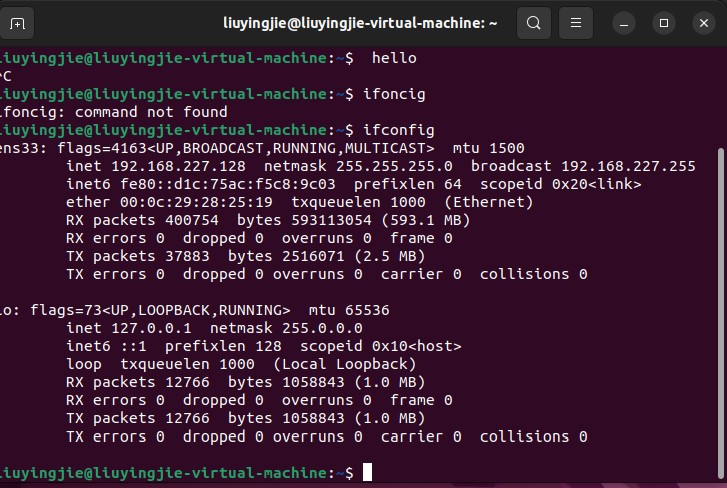
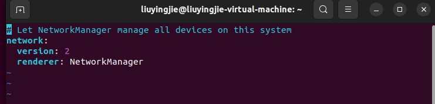
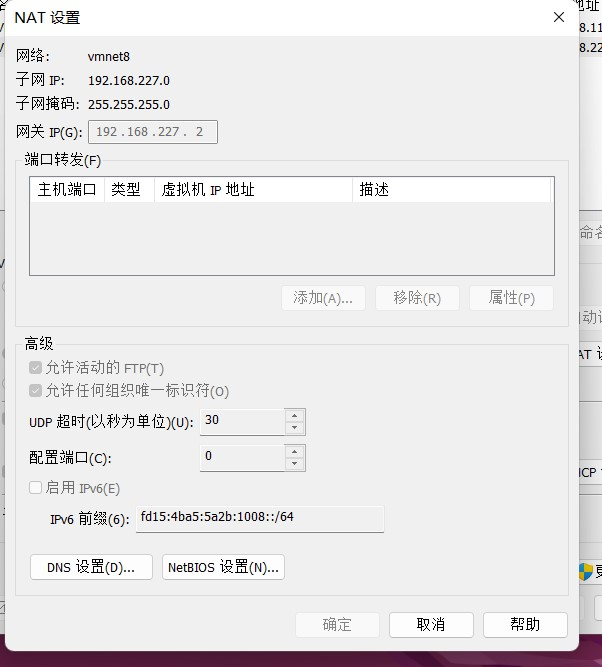
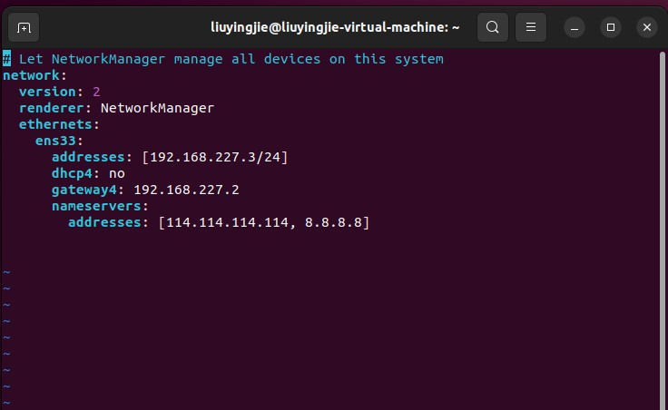

* 首先在命令行输入ifconfig查看网卡信息
  
  可见网卡名称是ens33，当前ip地址是192.168.227.128
*  ubuntu从17版本开始使用netplan进行网络配置管理，它的配置文件在`/etc/netplan/***.yaml`,如本机就是`/etc/netplan/01-network-manager-all.yaml`,编辑该文件
  
  上图中还没有进行任何网卡配置，下面举例介绍网卡配置
* 固定ip需要与ubuntu连接的网络的ip分配地址空间匹配，本文使用的是虚拟机，连接的是vmware的虚拟网络，虚拟网络信息如下：
  
  可用ip地址为192.168.227.X,此处拟将ip固定为192.168.227.3，以此为例，编辑信息如下：
```
ethernets:
    addresses:[192.168.227.3/24] 
      dhcp4:false
      gateway4: 192.168.227.2
      nameservers:
        addresses:[114.114.114.114, 8.8.8.8]
```
注意缩进对齐，编辑完成后，该yaml文件内容如下

* 编辑完成后，保存关闭该文件，在shell中输入`sudo netplan apply`,重新调用ifconfig检查是否成功
* 