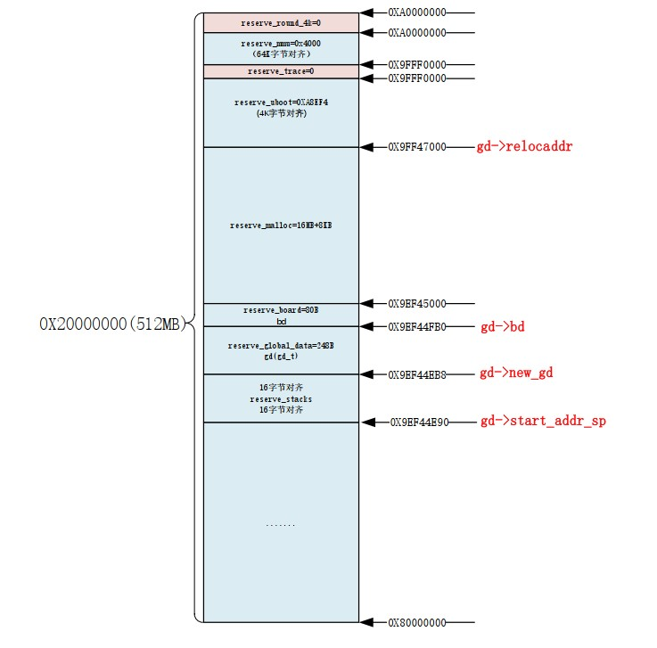

# 1 待整理
* 完整的嵌入式linux系统包含
  * bootloader
  * 内核
  * 设备树
  * 根文件系统

* Linux系统必须包含的三块
  * bootloader（如uboot）
  * kernel
  * rootfs

## 1.1 uboot启动流程（arm-mx6ull为例）
### 1.1.1 跳转到reset中断处理函数（arch/arm/lib/vectors.S）
   * 进入svc模式
   * 同时关闭FIQ和IRQ
   * 重定位中断向量表基址
   * 调用lowlevel_init函数
### 1.1.2 进入lowlevel_init函数(arch/arm/cpu/armv7/lowlevel_init.S)
   * 设置sp指针指向mx6ull内部ram
   * 栈上预留gdsize空间（global data）
   * 调用s_init函数
### 1.1.3 进入s_init函数(arch/arm/cpu/armv7/mx6/soc.c)
   * 解决芯片差异的，mx6ull不需要做任何处理，最终回到```reset```函数中的```save_boot_params_ret```函数继续执行```_main```函数
### 1.1.4 进入_main函数(arch/arm/lib/crt0.S)
   * 调用```board_init_f_alloc_reserve```预留早期malloc区域和gd内存区域
   * 调用```board_init_f```初始化ddr定时器等，完成代码拷贝
   * 重新设置sp、gd等，把它们从内部ram指向到外部ddr中
   * 调用```relocate_code```调用代码重定位函数将uboot拷贝至新地址
   * 调用```relocate_vectors```重定位中断向量表
   * 调用```c_runtime_cpu_setup```
     * 清除bss段
     * 调用```board_init_r```初始化board
在```_main```函数中，主要调用了board_init_f、relocate_code、relocate_vectors和board_init_r四个函数，接下来依次介绍这四个函数
#### 1.1.4.1 board_init_f(common/board_f.c)
* 初始化外设：串口、定时器等
* 初始化gd的各个成员变量
* uboot将自己拷贝到dram最后面地址区域，给Linux腾出空间，防止linux覆盖掉uboot
* 通过```initcall_run_list```函数运行初始化序列init_sequence_f里面定义的一系列函数，这些其实也都是在初始化gd的各个成员变量：
  * 获取代码长度设置给gd的mon_len成员变量
  * 初始化gd中与malloc有关的成员变量
  * 初始化cpu
  * 初始化定时器
  * 设置vddsoc电压
  * 获取各种时钟，如sd卡
  * 设置环境变量
  * 初始化串口，波特率等
  * 初始化&复位看门狗
  * 根据dram设置gd->ram_size的值
  * 处理mmu的tlb表位置
处理完之后的内存分配图如下:

#### 1.1.4.2 relocate_code(arch/arm/lib/relocate.S)
* 将uboot代码拷贝到dram尾部，循环拷贝，一次32字节，一直到拷贝计数符合条件终止
* 修复需要重新定位的符号值，在.rel.dyn段中的内容，防止出现寻址问题。（细节：第三方偏移地址。处理重定位问题）
* 添加pie选项生成位置无关的可执行文件，该选项会生成.rel.dyn段，代码迁移的时候需要如上方法一样<b>处理重定位问题</b>。
#### 1.1.4.3 relocate_vectors
用于重定位向量表
#### 1.1.4.4 board_init_r(common/board_r.c)
处理1.1.4.1中未处理完的初始化工作，这里面也是一个数组函数的一系列调用
这个数组是<b>init_sequence_r</b>
* 调试器相关初始化
* cache
* malloc
* 控制台
* 板级初始化，如I2C、USB、74XX芯片等
* stdio相关初始化
* 电源芯片
* flash
* nand
* emmc
* <b>其他cpu初始化</b>
* 各种输入输出设备，如lcd屏幕
* 中断初始化
* 初始化网络，读取环境变量ethaddr地址
### 1.1.2 run_main_loop
uboot启动后会进入倒计时，倒计时结束后没有按下回车就会自动启动linux内核，这个功能就是该函数完成的。
如果倒计时自然结束就执行```run_command_list```，此函数会执行参数s指定的一系列命令，也就是bootcmd的命令，这里面保存着默认的启动命令，因此linux内核启动，也就不会执行到后面的函数逻辑了。
如果倒计时结束前按下键盘，那么```run_commnad_list```就是空的，不会真的启动linux，从而会执行到```cli_loop```函数，该函数就是命令处理函数，负责处理输入的命令。
### 1.1.3 cli_loop(common/cli.c)
就是循环解析处理命令的函数，这里面有个新增命令的各种宏巧妙设计分析，值得看一下。（《正点原子 I.MX6U嵌入式Linux驱动开发指南v1.8.pdf》p840）。<b>我们无影终端跨平台的各种命令设计的参考可以参考这里。</b>