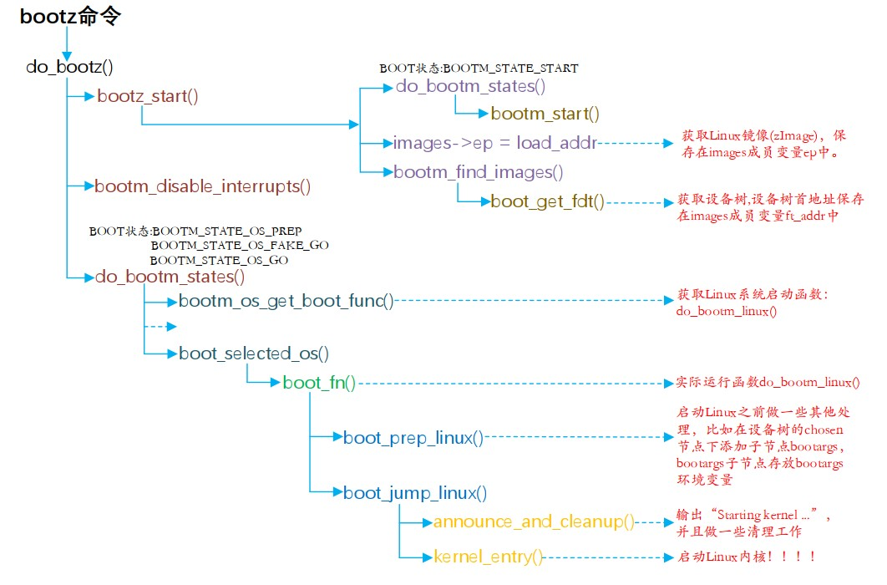
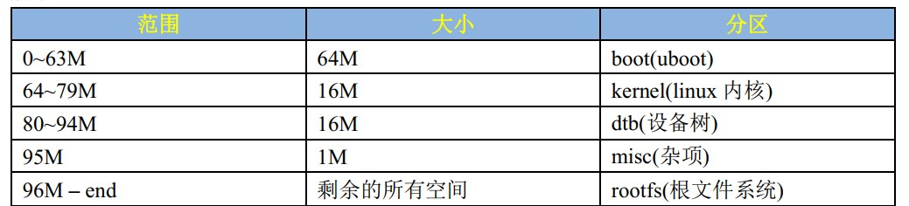

[TOC]

# 前提
一切基于arm，mx6ull。

# 1 待整理
* 完整的嵌入式linux系统包含
  * bootloader
  * 内核
  * 设备树
  * 根文件系统

* Linux系统必须包含的三块
  * bootloader（如uboot）
  * kernel
  * rootfs

## 1.1 uboot启动流程（arm-mx6ull为例）
### 1.1.1 跳转到reset中断处理函数（arch/arm/lib/vectors.S）
   * 进入svc模式
   * 同时关闭FIQ和IRQ
   * 重定位中断向量表基址
   * 调用lowlevel_init函数
### 1.1.2 进入lowlevel_init函数(arch/arm/cpu/armv7/lowlevel_init.S)
   * 设置sp指针指向mx6ull内部ram
   * 栈上预留gdsize空间（global data）
   * 调用s_init函数
### 1.1.3 进入s_init函数(arch/arm/cpu/armv7/mx6/soc.c)
   * 解决芯片差异的，mx6ull不需要做任何处理，最终回到```reset```函数中的```save_boot_params_ret```函数继续执行```_main```函数
### 1.1.4 进入_main函数(arch/arm/lib/crt0.S)
   * 调用```board_init_f_alloc_reserve```预留早期malloc区域和gd内存区域
   * 调用```board_init_f```初始化ddr定时器等，完成代码拷贝
   * 重新设置sp、gd等，把它们从内部ram指向到外部ddr中
   * 调用```relocate_code```调用代码重定位函数将uboot拷贝至新地址
   * 调用```relocate_vectors```重定位中断向量表
   * 调用```c_runtime_cpu_setup```
     * 清除bss段
     * 调用```board_init_r```初始化board
在```_main```函数中，主要调用了board_init_f、relocate_code、relocate_vectors和board_init_r四个函数，接下来依次介绍这四个函数
#### 1.1.4.1 board_init_f(common/board_f.c)
* 初始化外设：串口、定时器等
* 初始化gd的各个成员变量
* uboot将自己拷贝到dram最后面地址区域，给Linux腾出空间，防止linux覆盖掉uboot
* 通过```initcall_run_list```函数运行初始化序列init_sequence_f里面定义的一系列函数，这些其实也都是在初始化gd的各个成员变量：
  * 获取代码长度设置给gd的mon_len成员变量
  * 初始化gd中与malloc有关的成员变量
  * 初始化cpu
  * 初始化定时器
  * 设置vddsoc电压
  * 获取各种时钟，如sd卡
  * 设置环境变量
  * 初始化串口，波特率等
  * 初始化&复位看门狗
  * 根据dram设置gd->ram_size的值
  * 处理mmu的tlb表位置
处理完之后的内存分配图如下:

#### 1.1.4.2 relocate_code(arch/arm/lib/relocate.S)
* 将uboot代码拷贝到dram尾部，循环拷贝，一次32字节，一直到拷贝计数符合条件终止
* 修复需要重新定位的符号值，在.rel.dyn段中的内容，防止出现寻址问题。（细节：第三方偏移地址。处理重定位问题）
* 添加pie选项生成位置无关的可执行文件，该选项会生成.rel.dyn段，代码迁移的时候需要如上方法一样<b>处理重定位问题</b>。
#### 1.1.4.3 relocate_vectors
用于重定位向量表
#### 1.1.4.4 board_init_r(common/board_r.c)
处理1.1.4.1中未处理完的初始化工作，这里面也是一个数组函数的一系列调用
这个数组是<b>init_sequence_r</b>
* 调试器相关初始化
* cache
* malloc
* 控制台
* 板级初始化，如I2C、USB、74XX芯片等
* stdio相关初始化
* 电源芯片
* flash
* nand
* emmc
* <b>其他cpu初始化</b>
* 各种输入输出设备，如lcd屏幕
* 中断初始化
* 初始化网络，读取环境变量ethaddr地址
### 1.1.2 run_main_loop
uboot启动后会进入倒计时，倒计时结束后没有按下回车就会自动启动linux内核，这个功能就是该函数完成的。
如果倒计时自然结束就执行```run_command_list```，此函数会执行参数s指定的一系列命令，也就是bootcmd的命令，这里面保存着默认的启动命令，因此linux内核启动，也就不会执行到后面的函数逻辑了。
如果倒计时结束前按下键盘，那么```run_commnad_list```就是空的，不会真的启动linux，从而会执行到```cli_loop```函数，该函数就是命令处理函数，负责处理输入的命令。
### 1.1.3 cli_loop(common/cli.c)
就是循环解析处理命令的函数，这里面有个新增命令的各种宏巧妙设计分析，值得看一下。（《正点原子 I.MX6U嵌入式Linux驱动开发指南v1.8.pdf》p840）。<b>我们无影终端跨平台的各种命令设计的参考可以参考这里。</b>

### 1.1.4 bootz启动linux
如果没有进入1.1.3，则会通过bootz启动linux，流程参考如下，调用kernel_entry()之后，uboot的使命就结束了，真正进入了linux内核


## 1.2 NAND分区默认设计
一般包含boot kernel dtb misc和rootfs，如下

emmc设备一般第0个分区保存uboot，第1个分区保存kernel和设备树，第2个分区保存rootfs

## 1.3 uboot启动顺序
### 1.3.1 执行bootcmd
* 优先寻找loadbootscript脚本
* 没有的话，尝试loadimage
* zImage也没有的话，尝试运行netboot
### 1.3.2 执行mmcboot
* mmcargs设置bootargs
* 判断boot_fdt是否为yes或者try，如果是则loadfdt
* 如果load成功则调用bootz启动linux(```bootz ${loadaddr} - ${fdt_addr};```,如```bootz 0x80800000 - 0x83000000```)
* 至此，linux内核启动，其实最终目的就是从emmc中读取zImage镜像文件和设备树。核心4行代码如下：
``` shell
mmc dev 1 // 切换到emmc 
fatload mmc 1:1 0x80800000 zImage // 读取zImage到0x80800000
fatload mmc 1:1 0x83000000 imx6ull-14x14-evk.dtb // 读取设备树到0x83000000
bootz 0x80800000 - 0x83000000 //启动linux 
```
* <b>重要常用linux boot参数说明，参考正点原子IMX6U嵌入式Linux驱动开发指南1.8.pdf 第907页 33.3.2节</b>

## 1.4 linux make过程
一般过程如下：
``` shell
make xxx_defconfg # 根据系统以及arch/xxx/configs/yyy_defconfig 在当前根目录生成config
make # 正式编译生成elf文件vmlinux，以及最终生成zImage镜像
```
* --start-group --end-group可以解决链接先后导致的函数未定义问题。它是通过循环依赖解决这个问题的。
* vmlinux是make生成的elf文件，原始未压缩
* Image是LInux内核镜像文件，只包含可执行的二进制数据，也就是使用objcopy取消掉vmlinux中诸如符号表等的其他信息，同样也是未压缩的，它被保存在arch/arm/boot下
* zImage是经过gzip压缩后的Image
* uImage是老版本uboot专用的镜像文件，在zImage前加了64字节的头，包含：
  * 镜像文件的类型
  * 加载位置
  * 生成时间
  * 大小
  除非是古老的uboot，目前很少用到uImage了，因为新版uboot已经支持zImage启动了

## 1.5 Linux内核启动流程
### 1.5.1 链接脚本vmlinux.lds-指定了内核启动的第一行程序
制定了entry为stext，该函数在arch/arm/kernel/head.S中
### 1.5.2 stext函数
#### 1.5.2.1 启动之前(即进入stext前)要求
* 关闭mmu
* 关闭d-cache
* i-cache随意
* r0=0
* r1=机器id
* r2为atags或者设备树首地址
#### 1.5.2.2 stext主要过程
* 调用safe_svcmode_maskall确保cpu处于svc且关闭了所有中断
* 读取处理器id保存到r9
* 调用__lookup_processor_type检查当前系统是否支持此cpu，支持就获取procinfo，该结构体定义在arch/arm/include/asm/procinfo.h
* 调用__vet_atags验证atags或者设备树的合法性，该函数定义在arch/arm/kernel/head-common.S
* 调用__create_page_tables创建页表
* 将函数__mmap_switched的支持保存到r13中，该函数在位于arch/arm/kernel/head-common.S,最终它会<b>调用start_kernel函数</b>。
* 调用__enable_mmu使能mmu，使能它会执行__mmap_switch,最终它会调用start_kernel。
### 1.5.3 start_kernel的主要过程
它通过调用众多的子函数来完成linux启动之前的一些初始化工作。主要过程详见《I.MX6U嵌入式Linux驱动开发指南V1.8.pdf》p966-967。函数的最后它会调用rest_init().
* 死锁检测初始化
* 设置任务栈保护魔法数
* 设置多核处理器id，这是个弱函数，在arch/arm/kernel/setup.c中会有一个定义，如果没有定义，就是系统里面的空函数，也就是只操作单核
* 做一些与debug相关的初始化
* 栈溢出检测
* cgroup早期初始化
* 关闭cpu中断
* 与cpu有关的初始化
* 页地址相关初始化
* 打印Linux版本号等信息
* 架构相关初始化，包括设备树文件的读取
* 设置命令行
* 建立系统内存页区链表
* smp时准备boot其他cpu
* 处理热插拔的cpu页
* 打印命令行信息
* 解析console参数
* 初始化跳转表
* 设置log使用的缓冲区
* 构建pid哈希表
* 预先初始化vfs的目录项和索引节点缓存
* 定义内核异常列表
* 完成系统保留中断向量初始化
* 内存管理初始化
* 调度器初始化
* 关闭优先级抢占
* 检查并关闭中断
* 初始化rcu（Read copy update）
* 跟踪调试器初始化
* context tracking初始化
* 早期中断相关初始化
* 初始化IRQ
* tick初始化
* 定时器与高精度定时器初始化
* 软中断初始化
* 系统时间初始化
* slab初始化（内存分配器）
* 控制台初始化（之前的打印实际都是保存在缓冲中的，只有调用了该函数才能在控制台上看到打印信息）
* 锁自测
* kmemleak自检
* 测定bogoMIPS值，越大表示cpu性能越好
* cread_init
* fork初始化
* proc_cache初始化
* buffer初始化
* 密钥初始化
* 安全相关初始化
* 为vfs创建缓存
* 初始化信号
* 页写回初始化（writeback）
* 注册并挂载proc文件系统
* 初始化cpuset，将cpu和内存资源进行层次性集成管理，是cgroup使用的子系统
* 初始化cgroup
* 进程状态初始化
* 检查写缓冲一致性
* acpi子系统初始化
* ftrace初始化
* rest_init
### 1.5.4 rest_init
位于init/main.c,主要功能如下：
* 启动rcu锁调度器
* <b>调用kernel_init创建init内核进程，也就是pid为1的第一个进程，完成了内核态到用户态的转换</b>。它一开始是内核进程，后面会在根文件系统中查找init的程序，这个程序处于用户态。
* 创建kthreadd进程，pid为2，负责所有内核进程的调度
* 通过cpu_startup_entry进入idle进程，idle的pid为0，它是内核进程。

### 1.5.5 init进程
* 前置的一些初始化工作
  * smp调度初始化
  * 设备初始化do_basic_setup
  * 在rootfs上打开/dev/console调用控制台
  * 调用prepare_namespace挂载根文件系统，参数是由命令行参数指定的，也就是uboot的bootargs环境变量，比如root=/dev/mmcblk1p2 rootwait rw表示根文件系统在mmcblk1p2中
  * 
* 等待所有异步调用完成
* 释放init段内存
* 标记系统运行
* 尝试依次从/init /sbin/init /etc/init /bin/init /bin/sh启动系统，成功则完成，否则就往下找应用。