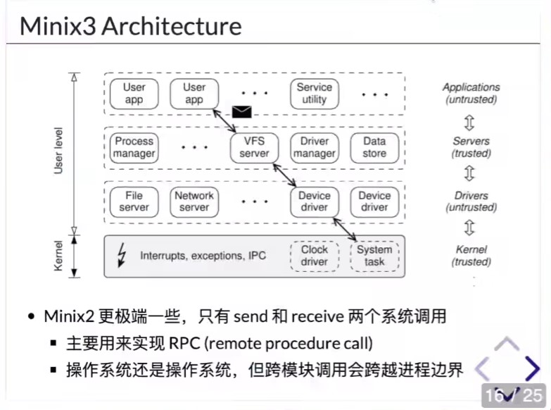

# 操作系统：设计与实现

[课程地址](https://jyywiki.cn/OS/2022/)

[视频链接](http://live.bilibili.com/21816941)

## 1. 视频重点摘抄

### 1.1 操作系统概述

#### 1.1.1 重要知识点

* 操作系统视角：对于上层应用，操作系统就是系统调用的实现api；对底层硬件，操作系统是c代码和最终的二进制文件。
#### 1.1.1.2 实操工具
* tldr是man的基础版，可以快速上手新命令基本用法

#### 1.1.1.3 推荐阅读

* 书籍：《UNIX传奇》

### 1.21 操作系统设计选讲
#### 1.21.1 重要知识点
* 18:00 posix标准手册导读
* 31:30 windows模拟linux介绍(wsl)
* 1:02:00 微内核目的是尽量把内核变小，把功能放到进程里，分析了标准系统调用，只有进程调度和内存映射是需要放在内核里的，execve加载器、驱动和文件系统的相关接口都可以放到进程里。
* 1:06:14 微内核定义图
* 1:16:05 minix架构图
  
*  
#### 1.21.1.3 推荐阅读
* [标准unix系统接口定义](https://pubs.opengroup.org)
    * XBD: Base Definitions
    * XSH: System Interfaces
    * XCU: Shell & Utils
    * XRAT: Rationale,这个非常关键，不仅告诉“是什么”，而且告诉“为什么”
* 《操作系统设计与实现 第二版》 下册就是代码，Andrew S. Tanenbaum,基于minix的，minix是微内核
* [seL4 white paper](res/seL4-whitepaper.pdf)