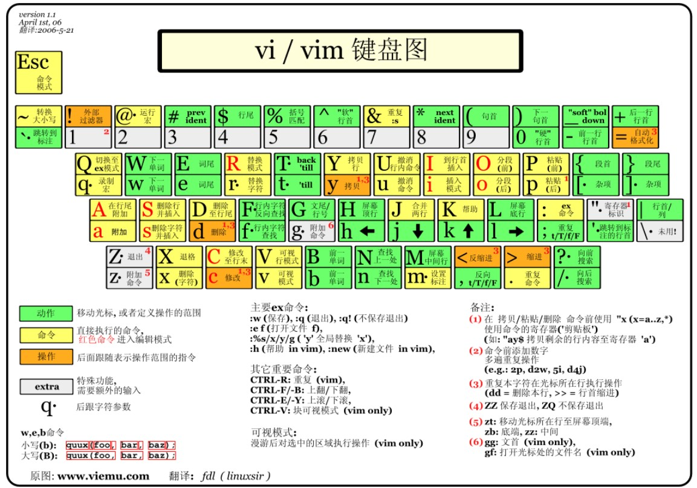

# vim基础教程
vim的价值意义就不再赘述了，个人认为就像打字一样，两个指头戳能打得飞快的高手也有，没必要要求所有人都练习标准打字方法，vim也是一样，一切都是生产工具，对你来说什么更高效就用什么。

## 1. vim基本概念介绍
vim是vi的增强工具，其命名来源也是vi（vi (i)mproved，也就是vim）,关于vi的来源本文就不介绍了，请自行搜索了解。一般我们可将vim分为三种模式：命令模式、插入模式和底线命令模式。
## 1.1 命令模式
刚刚打开vim默认进入的就是命令模式，插入模式和底线命令模式都是通过命令模式下按下某些按键进入的，例如命令模式下按下`i`即进入插入模式，光标位于刚刚命令模式所在的文字前，`a`同样也是进入插入模式，但是光标位于刚刚命令模式所在文字的后面。下面的表格对命令模式下所有的按键进行了汇总说明。

**注：命令模式下的光标是粗光标，插入模式下的光标是细光标，差异是，粗光标选中了一个文字，细光标则在是在文字之间的。**

    
    

图1 命令模式与插入模式光标对比

下表是命令模式下每个按键的功能说明。

表1 命令模式按键功能说明

<table>
    <tr>
        <th>名称</th>
        <th>说明</th>
        <th>分类</th>
    </tr>
    <tr>
        <td>h</td>
        <td>左移</td>
        <td rowspan='14'>移动命令</td>
    </tr>
    <tr>
        <td>i</td>
        <td>右移</td>
    </tr>
    <tr>
        <td>j</td>
        <td>下移</td>
    </tr>
    <tr>
        <td>k</td>
        <td>上移</td>
    </tr>
    <tr>
        <td>w</td>
        <td>把光标移动到下一个单词开始处</td>
    </tr>
    <tr>
        <td>W</td>
        <td>把光标移动到空格、换行或者制表符后的下一个单词开始处</td>
    </tr>
    <tr>
        <td>b</td>
        <td>把光标移动到上一个单词开始处</td>
    </tr>
    <tr>
        <td>B</td>
        <td>把光标移动到空格、换行或者制表符前的上一个单词开始处</td>
    </tr>
    <tr>
        <td>e</td>
        <td>把光标移动到下一个单词的尾部</td>
    </tr>
    <tr>
        <td>E</td>
        <td>把光标移动到空格、换行或者制表符后的下一个单词的尾部</td>
    </tr>
    <tr>
        <td>H</td>
        <td>移动光标到当前屏幕可见的第一行</td>
    </tr>
    <tr>
        <td>L</td>
        <td>移动光标到当前屏幕可见的最后一行</td>
    </tr>
    <tr>
        <td>n</td>
        <td>移动到查找内容的下一个位置</td>
    </tr>
    <tr>
        <td>N</td>
        <td>移动到查找内容的上一个位置</td>
    </tr>
    <tr>
        <td>i</td>
        <td>进入插入模式，光标位于命令模式光标选中文字前</td>
        <td rowspan='8'>插入命令</td>
    </tr>
    <tr>
        <td>I</td>
        <td>进入插入模式，光标位于当前行第一个非空字符前</td>
    </tr>
    <tr>
        <td>a</td>
        <td>进入插入模式，光标位于命令模式选中文字后</td>
    </tr>
    <tr>
        <td>I</td>
        <td>进入插入模式，光标位于当前行最后一个非空字符后</td>
    </tr>
    <tr>
        <td>o</td>
        <td>进入插入模式，光标位于原位置的下一行</td>
    </tr>
    <tr>
        <td>O</td>
        <td>进入插入模式，光标位于原位置的下一行</td>
    </tr>
    <tr>
        <td>s</td>
        <td>删除原光标选中的文字并进入插入模式</td>
    </tr>
    <tr>
        <td>S</td>
        <td>删除原光标行内所有文字，并定位在该行的第一个非空字符进入插入模式</td>
    </tr>
    <tr>
        <td>y</td>
        <td>复制拷贝,y后面加拷贝选项，详细说明见<a href="#111-yank命令">yank命令</a></td>
        <td rowspan=4>复制与粘贴</td>
    </tr>
    <tr>
        <td>Y</td>
        <td>复制当前行，后面不需要加拷贝选项</td>
    </tr>
    <tr>
        <td>p</td>
        <td>在当前光标行后粘贴拷贝的内容</td>
    </tr>
    <tr>
        <td>P</td>
        <td>在当前光标行前粘贴拷贝的内容</td>
    </tr>
    <tr>
        <td>r</td>
        <td>替换当前光标选中的字符，输了r之后直接输入需要替换的字符即可,替换一个字符后自动退出替换状态回到正常命令模式</td>
        <td rowspan=2>替换操作</td>
    </tr>
    <tr>
        <td>R</td>
        <td>连续替换当前光标选中的字符，按esc退出替换模式</td>
    </tr>
    <tr>
        <td>u</td>
        <td>撤销上一个操作</td>
        <td rowspan=2>撤销操作</td>
    </tr>
    <tr>
        <td>U</td>
        <td>撤销行内的操作</td>
    </tr>
    <tr>
        <td>J</td>
        <td>合并该行与下一行，如果前面先输入数字则表示合并与后面的n行，如5J表示合并后面5行</td>
        <td>行合并</td>
    </tr>
    <tr>
        <td>K</td>
        <td>帮助</td>
        <td>帮助</td>
    </tr>
    <tr>
        <td>x</td>
        <td>删除操作，删除光标选中的字符,删除后光标选中被删除字符的下一个字符</td>
    </tr>
    <tr>
        <td>X</td>
        <td>删除操作，删除光标选中的字符,删除后光标选中被删除字符的上一个字符</td>
    </tr>
    <tr>
        <td>v</td>
        <td>进入可视模式</td>
    </tr>
    <tr>
        <td>V</td>
        <td>进入多行可视模式</td>
    </tr>
    <tr>
        <td>:</td>
        <td>进入底线命令模式</td>
    </tr>
    <tr>
        <td>/</td>
        <td>向后搜索内容</td>
    </tr>
    <tr>
        <td>?</td>
        <td>向前搜索内容</td>
    </tr>
    <tr>
        <td>></td>
        <td>缩进</td>
    </tr>
    <tr>
        <td><</td>
        <td>反缩进</td>
    </tr>
    <tr>
        <td>esc</td>
        <td>回到命令模式！</td>
    </tr>
    <tr>
        <td>m</td>
        <td>!!!!!!!!!!!!</td>
    </tr>
    <tr>
        <td>c</td>
        <td>!!!!!!!!!!!!</td>
    </tr>
    <tr>
        <td>z</td>
        <td>!!!!!!!!!!!!</td>
    </tr>
    <tr>
        <td>q</td>
        <td>!!!!!!!!!!!!!</td>
    </tr>
    <tr>
        <td>Q</td>
        <td>!!!!!!!!!!!!</td>
    </tr>
    <tr>
        <td>t</td>
        <td>!!!!!!!!!!!!!</td>
    </tr>
    <tr>
        <td>T</td>
        <td>!!!!!!!!!!!!</td>
    </tr>
</table>

下图是网上大神汇总的命令模式下的键位说明图。

### 1.1.1 yank命令

## 1.2 插入模式

## 1.3 底线命令模式
