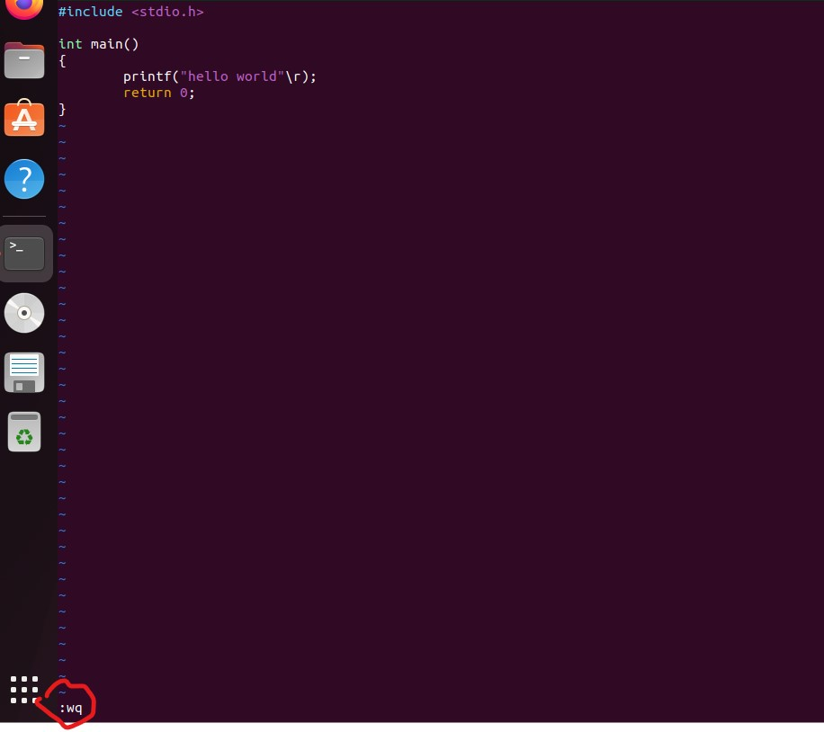

# vim基础教程(持续更新)
vim的价值意义就不再赘述了，个人认为就像打字一样，两个指头戳能打得飞快的高手也有，没必要要求所有人都练习标准打字方法，vim也是一样，一切都是生产工具，对你来说什么更高效就用什么。

## 1. vim基本概念介绍
vim是vi的增强工具，其命名来源也是vi（vi (i)mproved，也就是vim）,关于vi的来源本文就不介绍了，请自行搜索了解。一般我们可将vim分为三种模式：命令模式、插入模式和底线命令模式。
## 1.1 命令模式
刚刚打开vim默认进入的就是命令模式，插入模式和底线命令模式都是通过命令模式下按下某些按键进入的，例如命令模式下按下`i`即进入插入模式，光标位于刚刚命令模式所在的文字前，`a`同样也是进入插入模式，但是光标位于刚刚命令模式所在文字的后面。下面的表格对命令模式下所有的按键进行了汇总说明。

**注：命令模式下的光标是粗光标，插入模式下的光标是细光标，差异是，粗光标选中了一个文字，细光标则在是在文字之间的。**

    
    

图1 命令模式与插入模式光标对比

下表是命令模式下每个按键的功能说明。建议可以先跳过汇总表，先参考具体的关键用法，**基本用法逻辑**如下：
(N)+(R)+C+(O)
其中：
* 带括号表示该参数可选
* N表示数量，R表示操作寄存器，C表示命令，O表示选项
* 如：
  * `5"+yy`的N为5，操作寄存器为"+,命令为y，选项为y，整个命令表示拷贝当前行开始往下5行到剪贴板中
  * `6G`N为6，没有R，没有O，表示跳转到第6行

表1 命令模式按键功能说明

<table>
    <tr>
        <th>名称</th>
        <th>说明</th>
        <th>分类</th>
    </tr>
    <tr>
        <td>h</td>
        <td>左移</td>
        <td rowspan='25'>(查找)移动命令</td>
    </tr>
    <tr>
        <td>i</td>
        <td>右移</td>
    </tr>
    <tr>
        <td>j</td>
        <td>下移</td>
    </tr>
    <tr>
        <td>k</td>
        <td>上移</td>
    </tr>
    <tr>
        <td>w</td>
        <td>把光标移动到下一个单词开始处</td>
    </tr>
    <tr>
        <td>W</td>
        <td>把光标移动到空格、换行或者制表符后的下一个单词开始处</td>
    </tr>
    <tr>
        <td>b</td>
        <td>把光标移动到上一个单词开始处</td>
    </tr>
    <tr>
        <td>B</td>
        <td>把光标移动到空格、换行或者制表符前的上一个单词开始处</td>
    </tr>
    <tr>
        <td>e</td>
        <td>把光标移动到下一个单词的尾部</td>
    </tr>
    <tr>
        <td>E</td>
        <td>把光标移动到空格、换行或者制表符后的下一个单词的尾部</td>
    </tr>
    <tr>
        <td>H</td>
        <td>移动光标到当前屏幕可见的第一行</td>
    </tr>
    <tr>
        <td>L</td>
        <td>移动光标到当前屏幕可见的最后一行</td>
    </tr>
    <tr>
        <td>/</td>
        <td>向后搜索内容</td>
    </tr>
    <tr>
        <td>?</td>
        <td>向前搜索内容</td>
    </tr>
    <tr>
        <td>n</td>
        <td>移动到查找内容的下一个位置</td>
    </tr>
    <tr>
        <td>N</td>
        <td>移动到查找内容的上一个位置</td>
    </tr>
    <tr>
        <td>f</td>
        <td>查找命令，后接查找的字符，比如fx，查找当前光标往后一个x字符并把光标选中到该字符上</td>
    </tr>
    <tr>
        <td>F</td>
        <td>查找命令，后接查找的字符，比如Fx，查找当前光标往前一个x字符并把光标选中到该字符上</td>
    </tr>
    <tr>
        <td>t</td>
        <td>功能类似f，只是光标会移到目标字符的前一个字符上</td>
    </tr>
    <tr>
        <td>T</td>
        <td>功能类似F, 只是光标会移动到目标字符的前一个字符上</td>
    </tr>
    <tr>
        <td>$</td>
        <td>移动光标到当前行尾部</td>
    <tr>
    <tr>
        <td>0</td>
        <td>移动光标到当前行尾部</td>      
    <tr>
    <tr>
        <td>^</td>
        <td>移动光标到当前行首部非空字符</td>      
    <tr>
        <td>i</td>
        <td>进入插入模式，光标位于命令模式光标选中文字前</td>
        <td rowspan='8'>插入命令</td>
    </tr>
    <tr>
        <td>I</td>
        <td>进入插入模式，光标位于当前行第一个非空字符前</td>
    </tr>
    <tr>
        <td>a</td>
        <td>进入插入模式，光标位于命令模式选中文字后</td>
    </tr>
    <tr>
        <td>I</td>
        <td>进入插入模式，光标位于当前行最后一个非空字符后</td>
    </tr>
    <tr>
        <td>o</td>
        <td>进入插入模式，光标位于原位置的下一行</td>
    </tr>
    <tr>
        <td>O</td>
        <td>进入插入模式，光标位于原位置的下一行</td>
    </tr>
    <tr>
        <td>s</td>
        <td>删除原光标选中的文字并进入插入模式</td>
    </tr>
    <tr>
        <td>S</td>
        <td>删除原光标行内所有文字，并定位在该行的第一个非空字符进入插入模式</td>
    </tr>
    <tr>
        <td>y</td>
        <td>复制拷贝,y后面加拷贝选项，详细说明见<a href="#111-复制与粘贴">yank命令</a></td>
        <td rowspan=4>复制与粘贴</td>
    </tr>
    <tr>
        <td>Y</td>
        <td>复制当前行，后面不需要加拷贝选项</td>
    </tr>
    <tr>
        <td>p</td>
        <td>在当前光标行后粘贴拷贝的内容</td>
    </tr>
    <tr>
        <td>P</td>
        <td>在当前光标行前粘贴拷贝的内容</td>
    </tr>
    <tr>
        <td>r</td>
        <td>替换当前光标选中的字符，输了r之后直接输入需要替换的字符即可,替换一个字符后自动退出替换状态回到正常命令模式</td>
        <td rowspan=2>替换操作</td>
    </tr>
    <tr>
        <td>R</td>
        <td>连续替换当前光标选中的字符，按esc退出替换模式</td>
    </tr>
    <tr>
        <td>u</td>
        <td>撤销上一个操作</td>
        <td rowspan=2>撤销操作</td>
    </tr>
    <tr>
        <td>U</td>
        <td>撤销行内的操作</td>
    </tr>
    <tr>
        <td>J</td>
        <td>合并该行与下一行，如果前面先输入数字则表示合并与后面的n行，如5J表示合并后面5行</td>
        <td>行合并</td>
    </tr>
    <tr>
        <td>K</td>
        <td>帮助</td>
        <td>帮助</td>
    </tr>
    <tr>
        <td>x</td>
        <td>删除操作，删除光标选中的字符,删除后光标选中被删除字符的下一个字符</td>
        <td rowspan=2>删除操作</td>
    </tr>
    <tr>
        <td>X</td>
        <td>删除操作，删除光标选中的字符,删除后光标选中被删除字符的上一个字符</td>
    </tr>
    <tr>
        <td>v</td>
        <td>进入可视模式</td>
        <td rowspan=3>进入可视模式</td>
    </tr>
    <tr>
        <td>V</td>
        <td>进入多行可视模式</td>
    </tr>
    <tr>
        <td>Q</td>
        <td>切换至ex模式</td>
    </tr>
    <tr>
        <td>esc</td>
        <td>回到命令模式！</td>
        <td rowspan=2>模式切换</td>
    </tr>
    <tr>
        <td>:</td>
        <td>进入底线命令模式</td>
    </tr>
    <tr>
        <td>></td>
        <td>缩进</td>
        <td rowspan=2>缩进操作</td>
    </tr>
    <tr>
        <td><</td>
        <td>反缩进</td>
    </tr>
    <tr>
        <td>m</td>
        <td>m标记位置，后接标记名称，如ma则把标记存储到a，再通过'a跳转</td>
        <td rowspan=2>标记与跳转</td>
    </tr>
    <tr>
        <td>'</td>
        <td>跳转到指定标记位置，标记是由m进行的</td>
    </tr>
    <tr>
        <td>q</td>
        <td>录制宏，具体参考<a herf='112-宏的录制与使用'>宏的录制与使用</a></td>
        <td>宏录制</td>
    </tr>
    <tr>
        <td>z</td>
        <td>调整视图，后接调整选项，如zz将光标所在那一行移到屏幕中央,z-将光标所在那一行移动到屏幕底部,z回车将光标所在行移动到屏幕顶部</td>
        <td>视图调整</td>
    </tr>
</table>

下图是网上大神汇总的命令模式下的键位说明图。

### 1.1.1 复制与粘贴 
y命令表示复制，基本操作如下：
* `yy`表示复制本行到默认寄存器，`p`表示粘贴默认寄存器内容
* `nyy`表示复制从本行开始的n行到默认寄存器，比如`5yy`就是复制本行开始的5行到默认寄存器
* `y`也可以配合前置选择功能，比如通过v进入选择模式先选取需要拷贝的内容，然后通过`y`把选中的内容拷贝到默认寄存器
* 此外还可以通过前置配置拷贝寄存器来把拷贝内容放到指定寄存器，如
  * `"ayy`表示拷贝当前行到寄存器a中;
  * 需要粘贴寄存器a中的内容需要通过如下指令`"ap`进行粘贴
  * a-z标记命名寄存器，0-9表示专用寄存器，通过d或者c删除的内容会依次序存在这10个寄存器里面;
  * `"+yy`表示拷贝到剪贴板,`"+p`表示粘贴剪贴板内容到文中;
  * 如果需要查看寄存器内容，通过`:`进入底线命令模式，输入`registers`即可

### 1.1.2 宏的录制与使用
录制宏是为了自动做重复操作，比如如果想在连续的10行每行头部加入注释字符//,一种方案是通过底线命令模式下的s搜索替换完成，另一种方案就是录制与执行宏。以在光标所在行往下10行添加//的目的为例，宏的录制与使用如下：
* 按q加一个字母开始宏录制，如qa，就是开始录制宏，宏标记为a
* 接下来执行单次操作：
  * 按0定位光标到行首
  * 按i进入插入模式
  * 输入//
  * 按esc回到命令模式
  * 按j跳转到下一行
  * 按q完成录制
* 使用宏:命令模式下按下`9@a`表示执行宏a九次

## 1.2 插入模式
按i进入插入模式，就是正常输入内容，此处不再赘述，插入模式下按esc回到命令模式。

## 1.3 底线命令模式
底线命令模式的进入方法是在命令模式下按下`:`，在文档底部就会出现一个可以输入的光标，如下图所示，在这个里面输入对应的命令，完成命令后会自动退出底线命令模式，回到命令模式。

### 1.3.1 常用底线命令
如上图wq表示保存并退出，常用底线命令如下所示
* `set nu`:显示行号
* `wq`:保存并退出
* `registers`:显示寄存器内容
* `s`:搜索替换，基本格式如下：`{作用范围}s/{目标字符}/{替换的字符}/{替换标志}`,如`%s/red/blue/g`表示把全文的red替换成blue；`,$s/red/blue/g`表示把当前行至结尾的red搜索替换成blue,`5,$s/red/blue/g`表示把第5行开始的red替换成blue。
