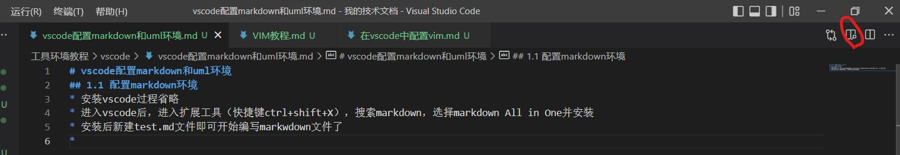
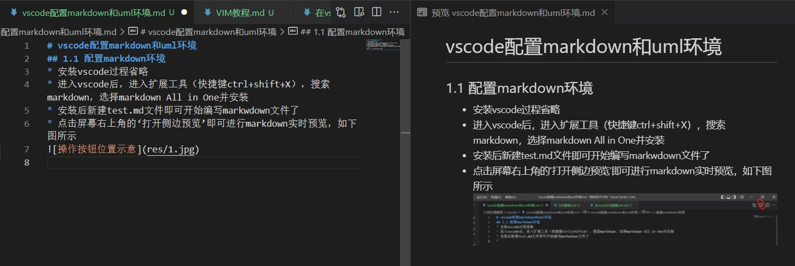
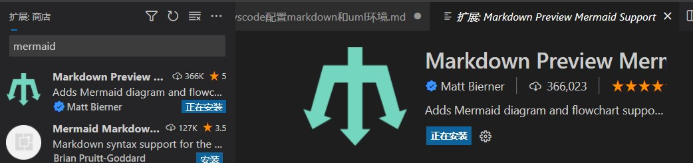
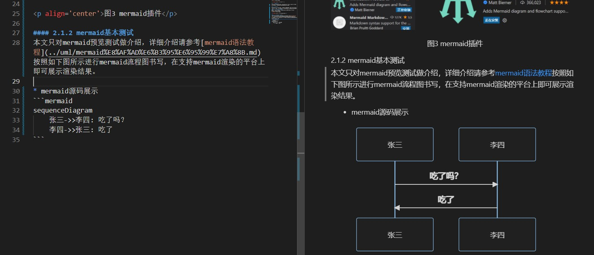

# windows10/11下vscode配置markdown和uml环境
## 1 配置markdown环境
* 安装vscode过程省略 
* 进入vscode后，进入扩展工具（快捷键ctrl+shift+X），搜索markdown，选择markdown All in One并安装
* 安装后新建test.md文件即可开始编写markwdown文件了
* 点击屏幕右上角的‘打开侧边预览’即可进行markdown实时预览，如下图1所示



<p align='center'> 图1 操作按钮位置示意 </p>



<p align='center'>图2 效果图</p>

## 2. 配置uml环境
uml工具常用的有plantUML和mermaid等，目前csdn和typora都是支持mermaid的，而IDEA对plantUML的支持比较完善。

### 2.1 mermaid
mermaid本质是一种标记语言，将文本翻译渲染成一种图。在markdown中的使用也比较简单，以代码格式书写，代码类型写成mermaid即可。
#### 2.1.1 mermaid插件安装
如下图所示，在扩展库中搜索mermaid，安装Markdown Preview Mermaid Support即可。


<p align='center'>图3 mermaid插件</p>

#### 2.1.2 mermaid基本测试
本文只对mermaid预览测试做介绍，详细介绍请参考[mermaid语法教程](../uml/mermaid%E8%AF%AD%E6%B3%95%E6%95%99%E7%A8%8B.md)按照如下图所示进行mermaid流程图书写，在支持mermaid渲染的平台上即可展示渲染结果。


<p align='center'>图4 vscode中mermaid源码渲染对比</p>

* mermaid源码展示


#### 2.2 plantUML
mermaid的一大遗憾是不能画类图，相比之下，plantUML的功能更完整，虽然csdn等平台目前还不支持实时渲染，但是vscode还是可以做到的。
* 插件中安装plantUML，该插件已经集成plantuml.jar和GraphViz，一般安装插件即可预览
* 如果出现如下报错，则说明系统没有安装java运行环境，需要在windows中安装java并配置相关环境变量:
  * 从[此处](https://javadl.oracle.com/webapps/download/AutoDL?BundleId=246474_2dee051a5d0647d5be72a7c0abff270e)下载jre安装包,在[此处](https://download.oracle.com/java/18/latest/jdk-18_windows-x64_bin.exe)下载jdk安装包;或者自己上网搜索适合自己系统的安装包进行安装。
  * 
  ``` json
  {"errno":-4058,"code":"ENOENT","syscall":"spawn java","path":"java","spawnargs":["-Djava.awt.headless=true","-Dfile.encoding=UTF-8","-Dplantuml.include.path=D:\\我的技术文档\\工具环境教程\\vscode;C:\\Users\\刘英杰\\.mume","-jar","c:\\Users\\刘英杰\\.vscode\\extensions\\shd101wyy.markdown-preview-enhanced-0.6.3\\node_modules\\@shd101wyy\\mume\\dependencies\\plantuml\\plantuml.jar","-pipe","-tsvg","-charset","UTF-8"]}
  ```
* 

