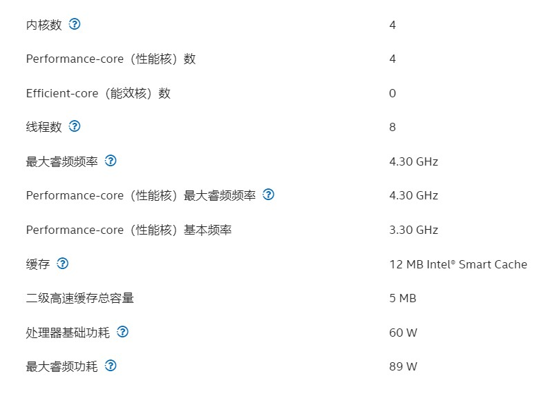
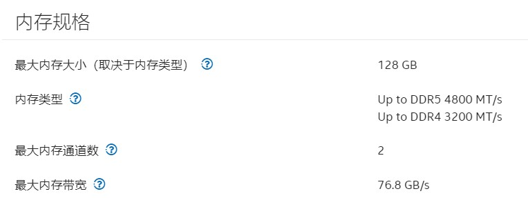
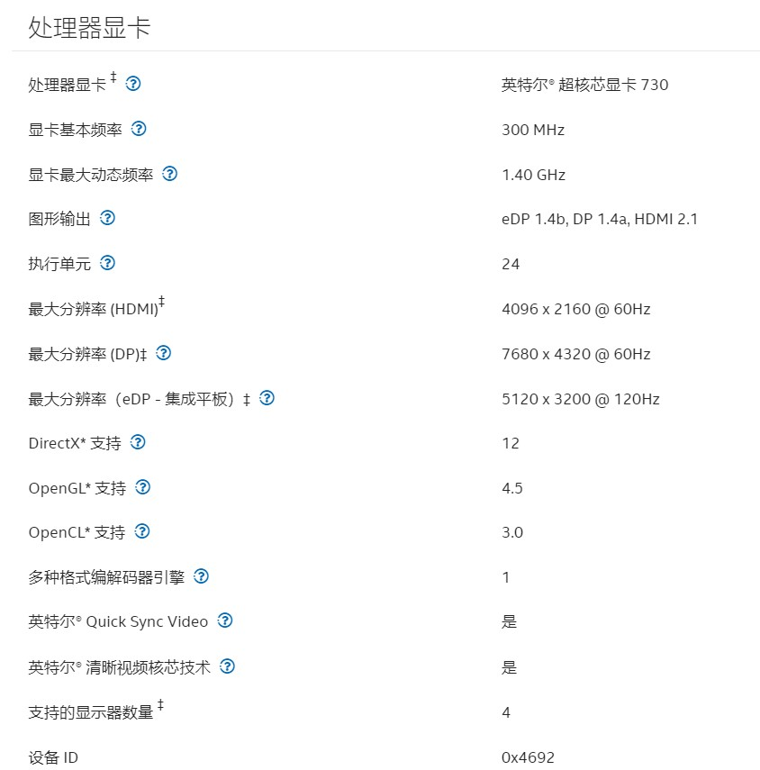
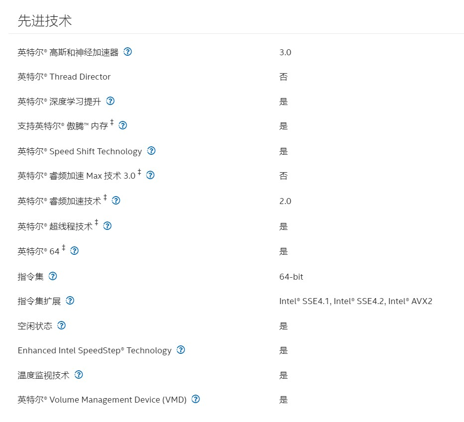
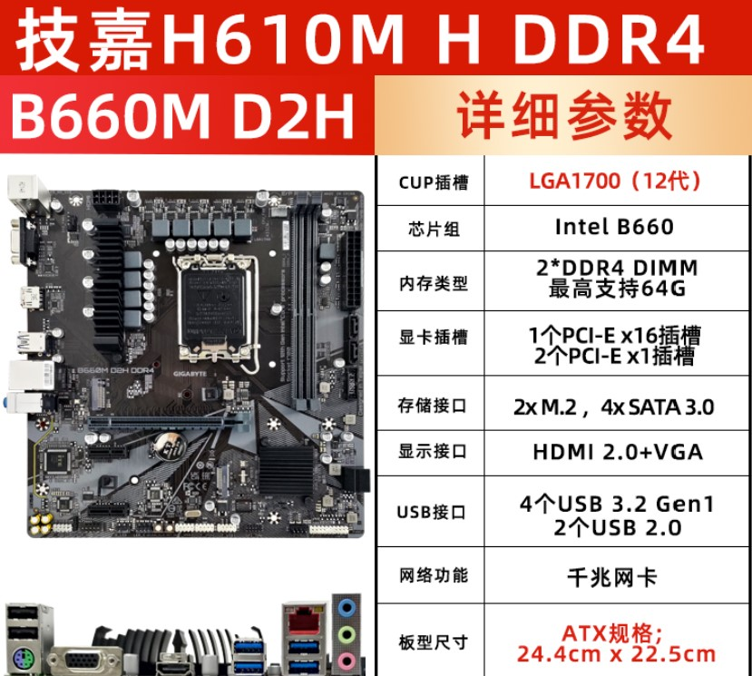
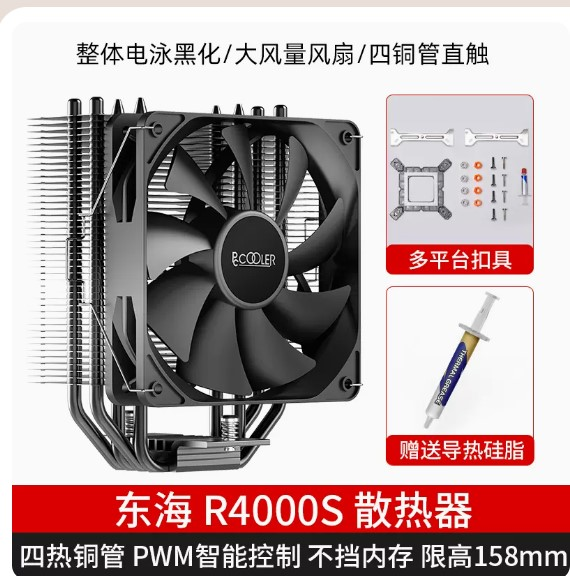
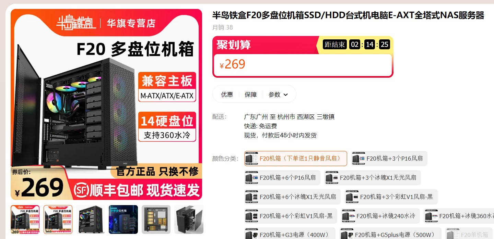
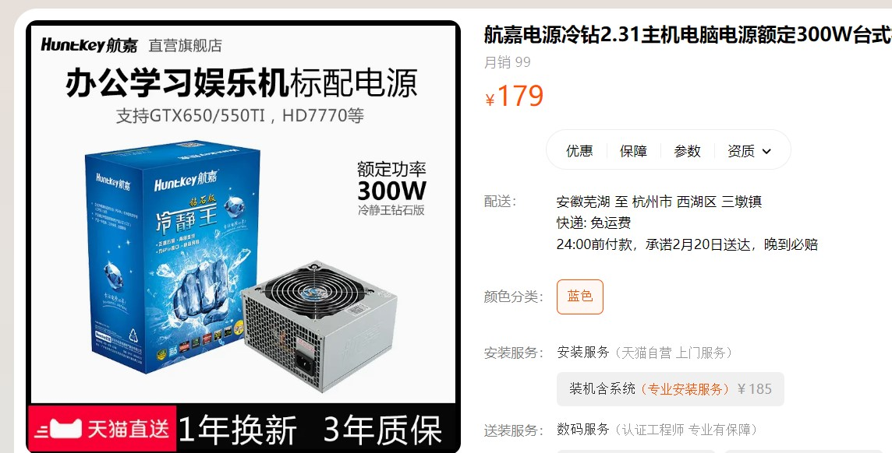
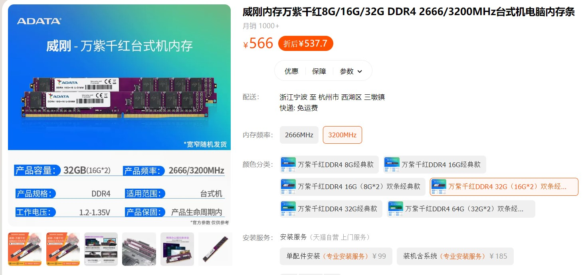

# 1. 配置信息

|组件|说明|价格|
|:--|---|--:|
|cpu|[i3-12100](#2.1)|659|
|主板|[h610m h](#2.2)|479|
|风扇|[超频三东海R4000W](#2.3)|79|
|机箱|[半岛铁盒](#2.4)|269|
|内存|[威刚万紫千红 16g*2](#2.6)|566|
|电源|[航嘉冷静王](#2.5)|179|
|nas硬盘|raid垃圾佬|x|
|固态系统盘|老电脑拆下来|0|
|总计||2231|
|(可以考虑)UPS电源|山特TG-BOX600 600VA360W|469|

# 2.附加信息
## 2.1 i3-12100

相较n5105,12100核显为最新的UHD730，支持AV1硬解，非常适合面向未来的影音服务搭建。

## 2.2 技嘉h610M H

12100适合的主板主要有b660和h610两个系列，nas的话h610足够了。型号可以再具体对比下，这个只是参考。

## 2.3 超频三东海R4000W

[官方链接](https://detail.tmall.com/item.htm?abbucket=14&id=672542191138&rn=6f79b7ea9abb15cdb8cfea60c3527210&spm=a1z10.5-b-s.w4011-14496708722.65.42b07fc3f3p8hJ&skuId=5009949246506)

## 2.4 半岛铁盒

## 2.5 航嘉冷静王

[官方链接](https://detail.tmall.com/item.htm?abbucket=14&id=19555219326&rn=9c8145d0f87484e3223e71833ed1b0a8&spm=a1z10.5-b-s.w4011-18640716814.79.409d4f5cpXuDUq&skuId=3922809630568)

## 2.6 威刚万紫千红
16g一条，搞两条

